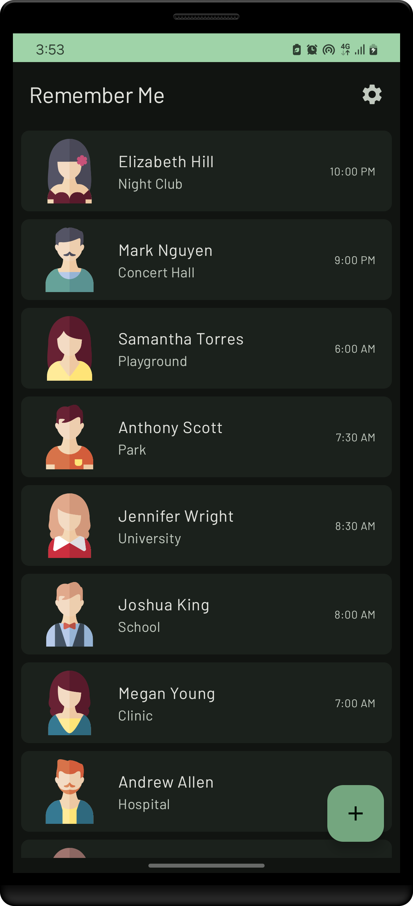
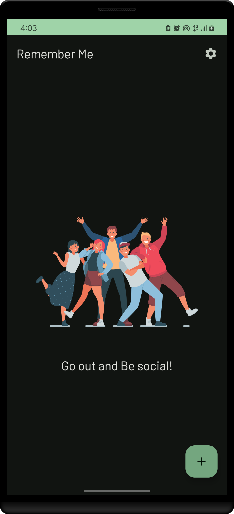
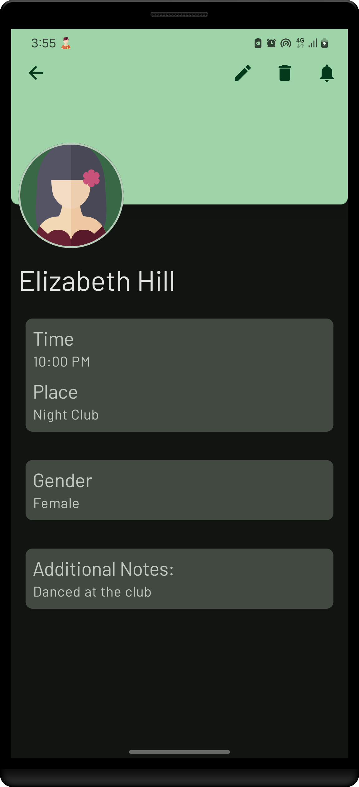
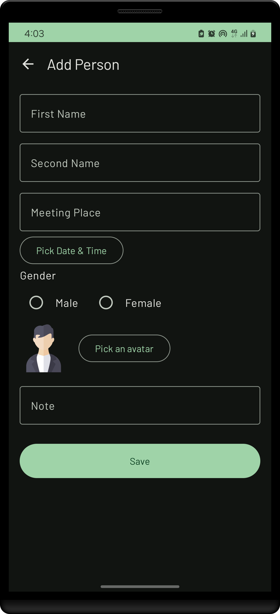
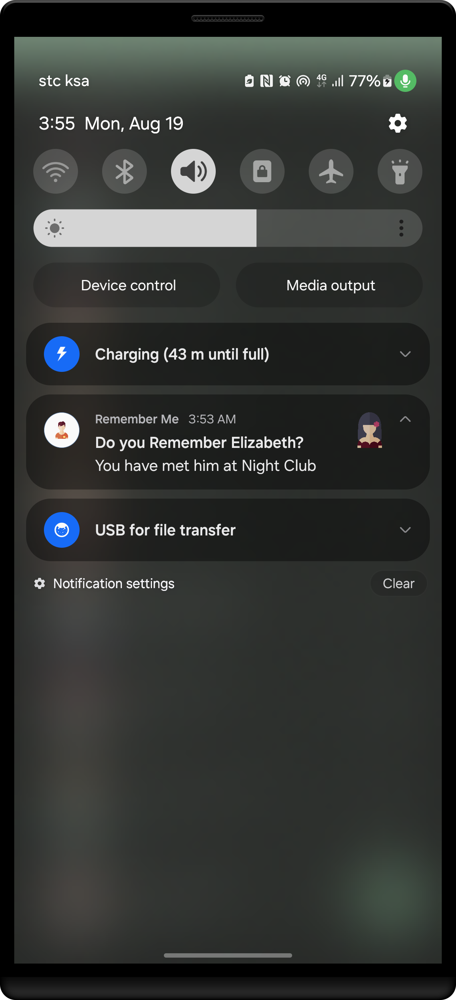
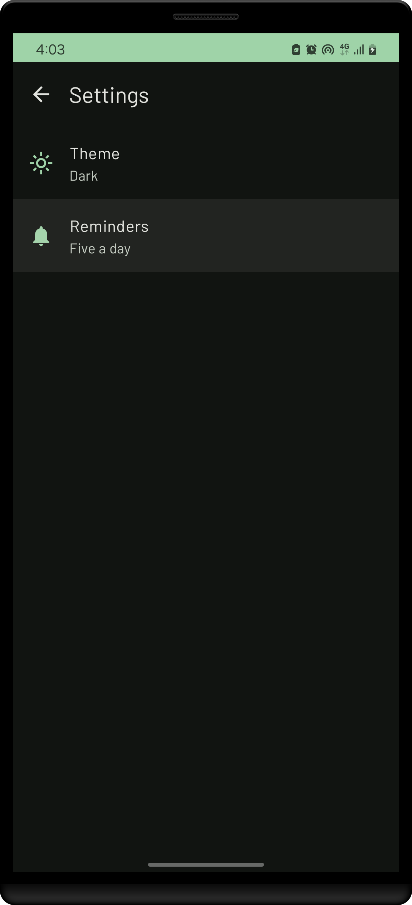

Here's a detailed README file for your **RememberMe** project:

---

# RememberMe

[](https://opensource.org/licenses/MIT)
[](https://www.android.com/)

**RememberMe** is an Android application designed to help users keep track of the people they've met and set reminders for interactions. It allows users to schedule notifications based on different repetition intervals, ensuring they never forget important connections.

[Watch the video](screenshots/remember_me_app.mp4)

## Table of Contents

- [Features](#features)
- [Architecture](#architecture)
- [Libraries Used](#libraries-used)
- [Installation](#installation)
- [Usage](#usage)
- [Screenshots](#screenshots)
- [Contributing](#contributing)
- [License](#license)

## Features

- **Reminders Scheduling:** Set daily, thrice-daily, or five-times-a-day reminders for interactions.
- **Deep Linking:** Directly navigate to a specific person from the notification.
- **Notification Handling:** Notifications with customizable content.
- **Permissions Management:** Handle notification permissions seamlessly.
- **Theme Customization:** Personalize the app's appearance according to user preferences.

## Architecture

The project follows **Clean Architecture** with a **feature-layered** approach to ensure separation of concerns and scalability:

- **Presentation Layer:** Contains UI-related components like `MainActivity` and ViewModels.
- **Domain Layer:** Holds the business logic and domain models.
- **Data Layer:** Manages data sources like repositories and workers, including `NotificationWorker`.

## Libraries Used

- **Jetpack Compose:** For building native UI.
- **Hilt:** For dependency injection.
- **WorkManager:** To schedule and manage background tasks.
- **Coroutines & Flow:** For asynchronous programming.
- **Dagger Hilt:** Dependency injection framework for Android.
- **Firebase:** For authentication and backend services.
- **Room:** Persistence library for managing local data storage.

## Installation

To get started with **RememberMe**, follow these steps:

1. **Clone the repository:**

   ```bash
   git clone https://github.com/omer358/Remember-Me.git
   cd Remember-Me
   ```

2. **Open in Android Studio:**

    - Open the project in Android Studio.
    - Sync the Gradle files.

3. **Build the project:**

    - Click on `Build > Make Project`.

4. **Run the app:**

    - Connect an Android device or start an emulator.
    - Click on `Run > Run 'app'`.

## Usage

1. **Setting Reminders:**
    - Choose the reminder interval (Once a day, Thrice a day, or Five times a day) from the settings screen.

2. **Receiving Notifications:**
    - Ensure notification permissions are granted. You will receive notifications based on the set interval.

3. **Deep Linking:**
    - Clicking on a notification will navigate you directly to the details of the person you're reminded about.

## Screenshots

Here are some screenshots of the **RememberMe** app:

|                                        home screen                                        |                              empty state screen                              |
|:-----------------------------------------------------------------------------------------:|:----------------------------------------------------------------------------:|
|                      |  |
|                                   person details screen                                   |                              add_person screen                               |
|  |    |
|                               reminder notification screen                                |                               settings screen                                |
|              |       |


## Contributing

Contributions are welcome! Here's how you can help:

1. **Fork the repository.**
2. **Create a new branch** for your feature or bug fix.
3. **Submit a pull request** after committing your changes.

Please make sure to follow the code style and write tests where necessary.

## License

**RememberMe** is licensed under the [MIT License](LICENSE). Feel free to use, modify, and distribute this project as per the license.